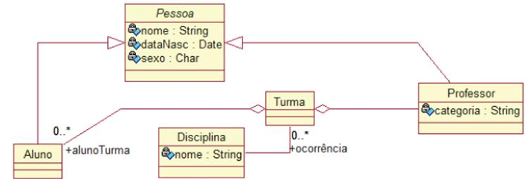

## What is this

Just a simple exercice to train some object orientation principles using Typescript. The model that will be implementated is that:




## Instalation

All is needed is to have [NodeJs Installed](https://nodejs.org/en/download/).

After that just install the dependencies packages with npm:

```shell
npm install
```

Or, for yarn lovers:


```shell
yarn
```

## Executing

Just execute the start script in package.json with:
```shell
npm start
```
Or, for yarn lovers:
```shell
yarn start
```


